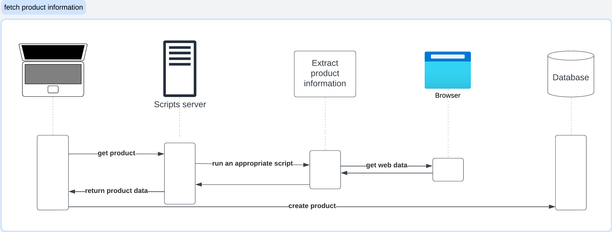
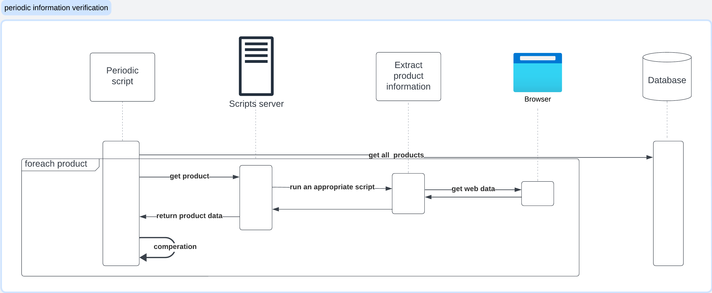
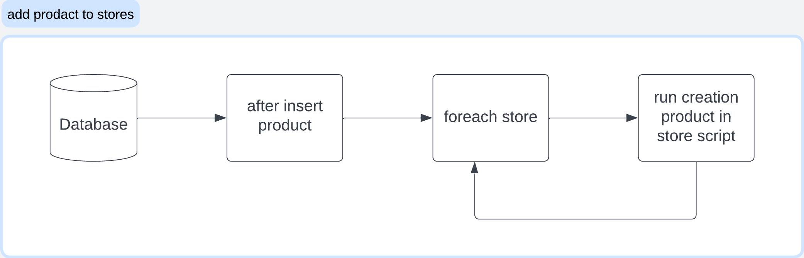

# Drop-Shipping desigh
The goal of this project is to automate drop-shipping with minimal human involvement.

The project should be for all the target sites - our stores, from the resource sites - the site from which we will buy the product
In the first step, AliExpress will be the resource site, and eBay will be the destination site.

>**Assumption:** The site from which we will order the products will not block the user for us due to multiple orders. (because there is no reason for someone to buy dozens of products from the same place and to different addresses each time)

## Full design diagram

### Let break it dwon!
The project is made up of several parts:
* Fetch information about products from the source site and saving them
* A periodic process that checks that the saved information is still available (if it's website accessibility, complete if published...)
* Adding the product for the relevant stores
* In the case of a customer purchase, automatic purchase of the product from the source site and sending it to the customer

### Fetch prodact information

The purpose of this component is to fetch information about a product that we would like to sell from the source site

When you want to add a new product for sale, the user will make a request through GUI to import information about the product using the url where the product is located  
The request will be sent to a scripts server where the url will be decoded to know from which site the product was taken  
And trigger a script depending on the site (script for each site), will decode the information in it and return the information to the server which it will send to the user  
The user will see the information about the product, verify with the site that the information is extracted correctly, and add the product to the DB

### Periodic information verification

The purpose of this component is to check that the source site is still available, to check inventory if the source site publishes this information.
If there is no access to the site or if there is no stock

A periodic process pulls all products from the DB
For each product, the process will do the following:
fetch product information using the url that save in the DB
The request will be sent to a scripts server where the url will be decoded to know from which site the product was taken  
And trigger a script depending on the site (script for each site), will decode the information in it and return the information to the server which it will send to periodic process.  
A comparison will be made between the information from the DB and the information we received from the website
If the information is different, an appropriate action will be taken according to the change and a message will be sent to the manager

### Add prodacr to stores

When a new product enters the DB, a process that adds the new product to all stores will be triggered
When a new product enters the DB, a process that adds the new product to all ^[relevant] stores will be triggered
Each store has a process that adds products to it.
>**Assumption:** Adding a product to different stores from the same site you can use the same process but you will need different parameters to access the store

^[relevant]: Not all stores will advertise all products. From maximum profit limits for the store, creating a concept for the store (garden, furniture...) etc.

### Prodact purchase

The following process is designed to make a purchase for the customer

When a customer makes a purchase, behind the scenes they access a url that accesses the scripts server  
The scripts server trigger a script according to the drop shipping from which the product is made  
The script accesses the website and makes a purchase for the customer

## Milestons

In the first phase we will support one source site - Aliexpress and one product in one store on one destination site - Ebay.  
The purchase of the orders will be done manually